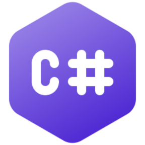

### Hi, my name is Eugene 👋 and I ❤️ Backend and Linux

### Skills 🏗️
- **Languages**: <i>C#, SQL, Bash, PHP, JavaScript.</i>
- **Backend Frameworks**: <i>ASP.NET Core, Symfony.</i>
- **Databases**: <i>PostgreSQL, MSSQL, MySQL, MongoDB.</i>
- **ORM**: <i>Entity Framework, Doctrine.</i>
- **Tests**: <i>XUnit, &nbsp;PHPUnit.</i>
- **DevOps**: <i>Linux, Docker, Git.</i>
- **Frontend**: <i>Blazor, Vue.js.</i> 

### Area of interest 🛰️

<i>Unix, Clean Architecture, Databases, Microservices, Computer networks.</i>

### Favorite Tech 👾

*Tools, languages, and other things that I like to work with.*

<table>
  <tr>
    <td align="center" width="96">
      
       C#
    </td> 
  <td align="center" width="96">
    
     .NET Core
  </td>

  <td align="center" width="96">
    
     Symfony
  </td>
  <td align="center" width="96">
    
     PostgreSql
  </td>
  <td align="center" width="96"> 
    
     Docker
  </td>
  <td align="center"  width="96">
    
     Fedora
  </td>
  </tr>
</table>
