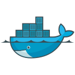

### Hi, my name is Eugene 👋 and I ❤️ Backend and Unix

### Skills 🏗️
- **Languages**: <i>C#, TypeScript, SQL, Bash</i>
- **Backend**: <i>ASP.NET Core</i>
- **Client**: <i>React, React Native</i>
- **Databases**: <i>PostgreSQL, MSSQL, MySQL, MongoDB, Redis</i>
- **ORM**: <i>Entity Framework, Dapper</i>
- **Brokers**: <i>RabbitMQ</i>
- **Tests**: <i>XUnit</i>
- **DevOps**: <i>Git, Linux, Docker, Kubernetes</i>

### Area of interest 🛰️

<i>Linux, Backend, Microservices, Software Architecture, Databases, Computer networks</i>

### Favorite Tech 👾

*Tools, languages, and other things that I like to work with*

